# Waypoint Operations

Enterprise Delivery Planning & Operational Execution System for Waypoint Group

[Live Application (HTTPS)](https://techtrithalon.duckdns.org) · [Demo Video (YouTube)](https://youtu.be/PAZZ5sISb48) · [Design Documentation](docs/waypoint-design-documentation.md) · [Technical Reference](docs/TECHNICAL_REFERENCE.md)

---

## Overview

Waypoint Operations is a logistics planning and field execution platform built for **Waypoint Group**, a retail conglomerate operating across Sri Lanka with three distinct brands (Fresh, Style, and Tech), 120 retail outlets, two central distribution depots (Peliyagoda and Kandy), and a constrained fleet of 60 vehicles.

During peak operational periods, unconstrained retail order volume exceeds available vehicle payload, volumetric capacity, and driver operating time budgets. The platform addresses this challenge through **constraint-safe planning**: allocating store orders into feasible vehicle trips, deterministically enforcing physical and regulatory rules, and generating auditable deferral records when capacity limits are reached.

Instead of operating as disconnected role portals, Waypoint Operations connects all operational actors—Store Managers, Dispatchers, Warehouse Loaders, and Field Drivers—into a single digital chain of custody. Orders move from initial placement through algorithmic planning, warehouse verification, mobile delivery execution, and store receipt confirmation.

The system is architected around strict operational authority: Spring Boot and PostgreSQL govern all persistent state, transactional workflows, and rule validations. External optimization services act strictly as advisory proposal engines, ensuring operational integrity is preserved under all conditions.

---

## Engineering Highlights

- **Connected Four-Role Lifecycle**: A single closed-loop workflow connecting Store Manager order creation, Dispatcher schedule publication, Loader dock counting, Driver delivery execution, and Store receipt verification.
- **Server-Authoritative R1–R12 Validation**: Every trip assignment is evaluated against twelve deterministic business constraints before publication. Neither human overrides nor automated solvers can bypass validation.
- **Optimization Without Surrendered Authority**: Python CP-SAT solvers generate candidate allocations, while Spring Boot independently validates and decides publication. Optimization proposes; validation decides; persistence records.
- **Offline-First Field Execution**: Field drivers execute deliveries, capture digital signatures, and record photos without network connectivity. Mutations are buffered in a local IndexedDB outbox and synced idempotently.
- **End-to-End Chain of Custody**: Physical handovers are verified at each boundary: warehouse manifests flag dock shortfalls, drivers collect multi-modal proof of delivery, and store managers confirm or dispute received quantities.
- **Resilient Exception Triage**: Discrepancies at the loading dock, doorstep delivery failures, and store receipt disputes are routed into a centralized Dispatcher Exceptions queue for binding operational resolution.

---

## End-to-End Operational Flow

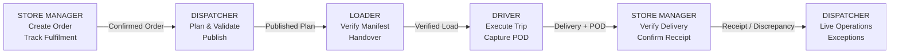

Waypoint Operations is not a collection of isolated dashboards; it is a unified operational state machine:

1. **Store Manager Order Placement**: Store managers submit daily replenishment orders prior to the 16:00 Asia/Colombo cutoff. Orders specify category lines, with server-derived volumetric and weight estimates.
2. **Dispatcher Planning & Validation**: Dispatchers capture an immutable planning snapshot, construct candidate trips, validate them against rules R1–R12, and publish frozen manifests. Deferrals generate auditable store notifications.
3. **Loader Manifest Verification**: Warehouse personnel open published load tasks on dock tablets, count physical cases, and execute digital handover. Shortfalls trigger vehicle holds and open dispatcher exceptions.
4. **Driver Trip Execution & POD**: Drivers execute sequential stop itineraries via mobile PWA. Deliveries require recipient signature, photo proof, and timestamped verification, operating online or offline.
5. **Store Receipt & Discrepancy Handling**: Store managers inspect delivered items and submit clean receipt confirmations or line-item disputes.
6. **Dispatcher Live Operations & Exceptions**: Dispatchers monitor live trip telemetry and adjudicate escalations (dock shortfalls, delivery failures, store disputes) with binding resolutions.

---

## Product Walkthrough

### Primary Operational Workflow

#### Dispatcher Command Center
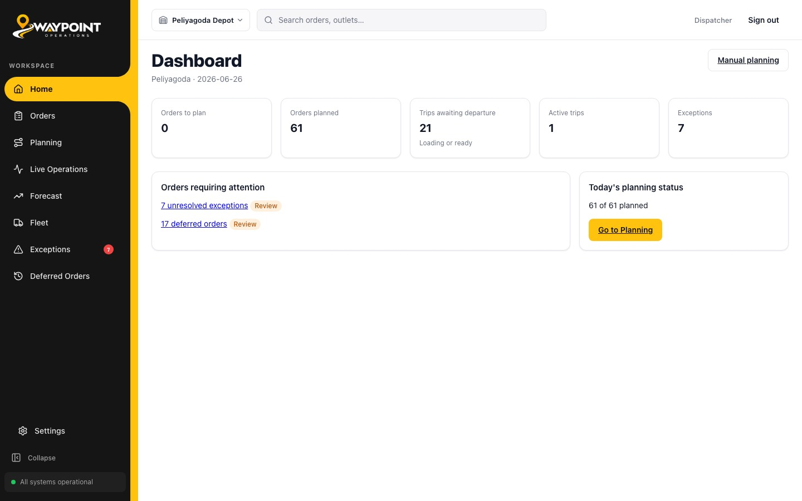
*Central operational dashboard showing real-time fleet utilization, confirmed order volumes, loading readiness across depots, and pending exception counts.*

#### Constraint-Checked Planning Engine
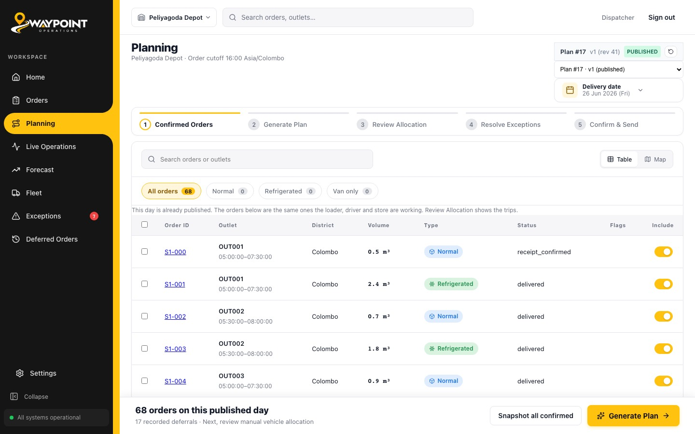
*Interactive trip builder validating all 12 hard rules (R1–R12) in real time. Shows volume, payload weight, daily time budget, and fuel quota utilization bars alongside durable deferral controls.*

#### Warehouse Loader Terminal
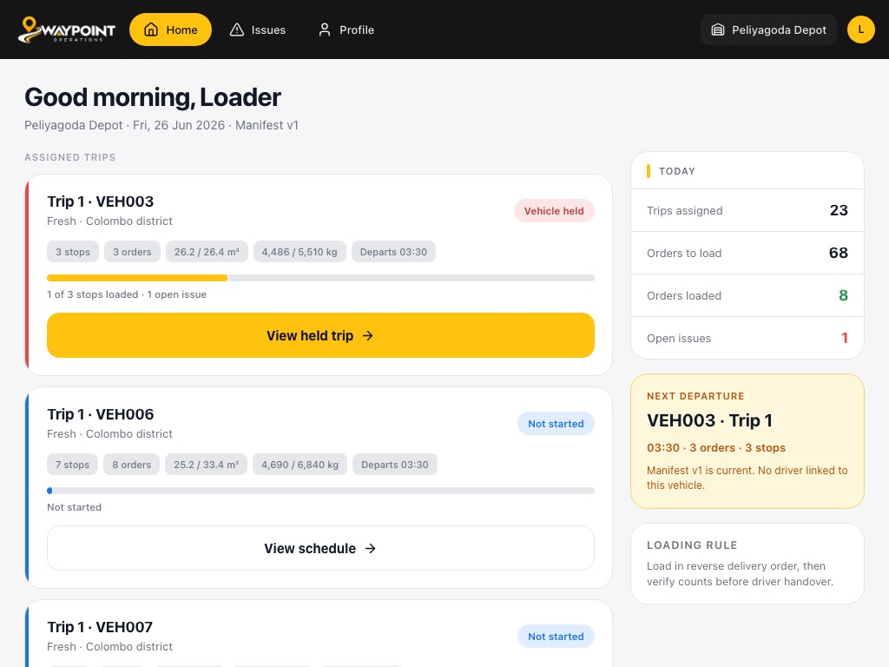
*Dock-optimized terminal for warehouse personnel. Enables digital manifest case counting, automated vehicle slot holds upon shortfall detection, and authenticated driver handover.*

#### Field Driver Mobile PWA
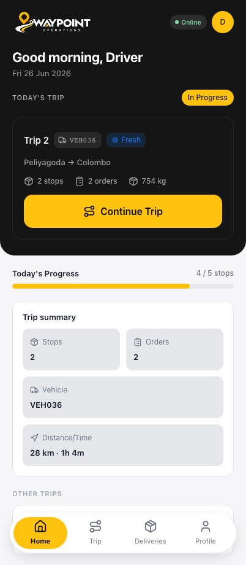
*Smartphone-optimized driver interface displaying assigned trip stops, navigation windows, multi-modal Proof of Delivery (signature and photo), and background sync status.*

#### Store Manager Workspace
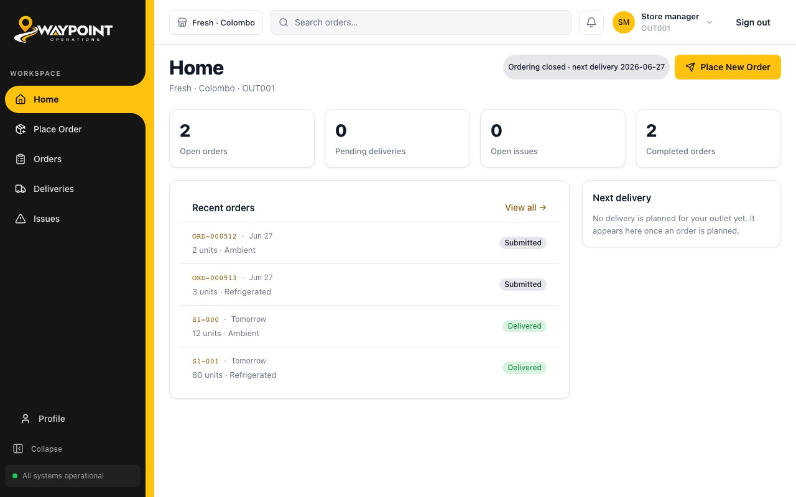
*Retail outlet portal showing active order statuses, scheduled delivery arrival windows, quick-order placement, and pending delivery receipt confirmations.*

#### Live Fleet Operations
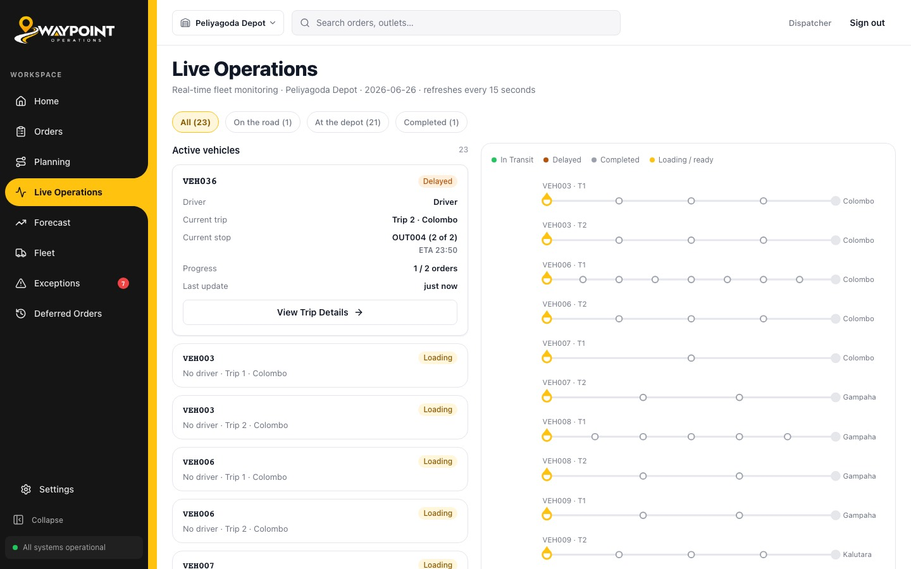
*Real-time fleet monitoring board tracking vehicle milestones, active stop progression, transit delays, and completed deliveries across regional hubs.*

---

### Supporting System Views

#### Secure Role Authentication
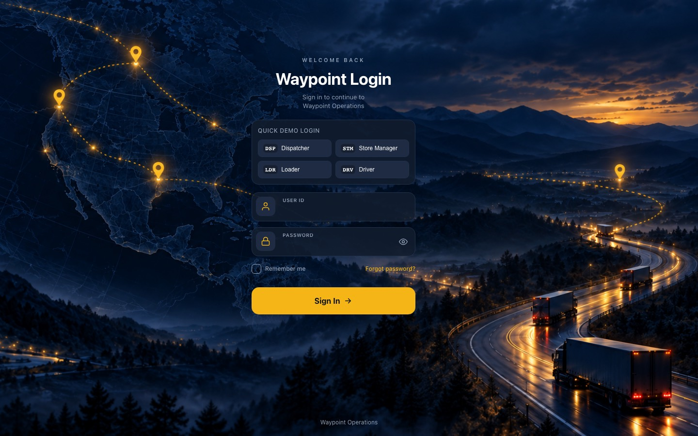
*Role-scoped authentication gateway enforcing opaque server-managed sessions, anti-brute-force rate limiting, and demo credential shortcuts.*

#### Centralized Order Management
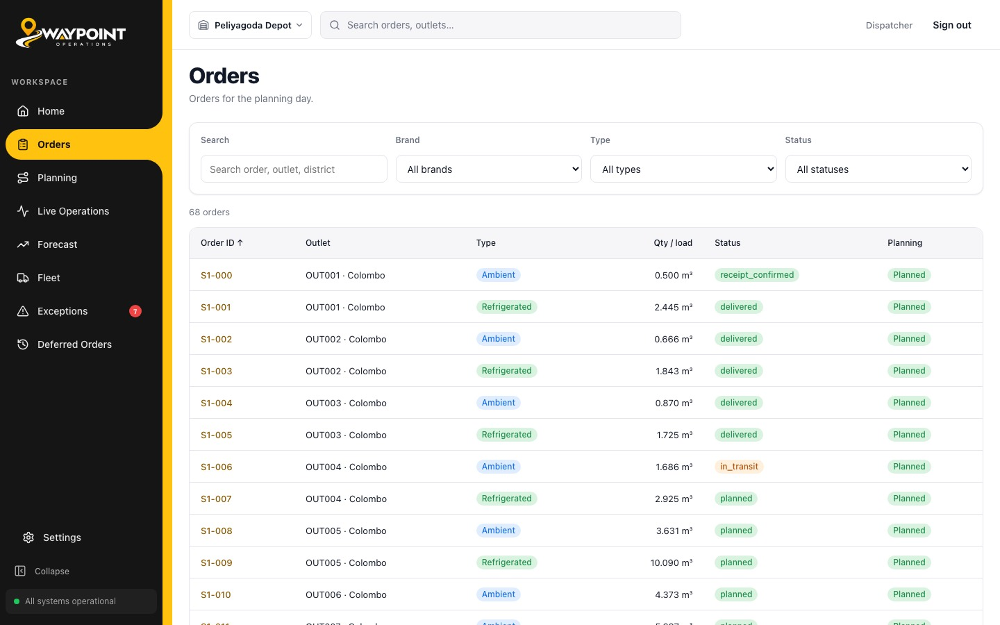
*Order intake queue enforcing the 16:00 daily cutoff, grouping store demand by brand, temperature class, delivery window, and geographic district.*

#### Operational Exceptions & Disputes
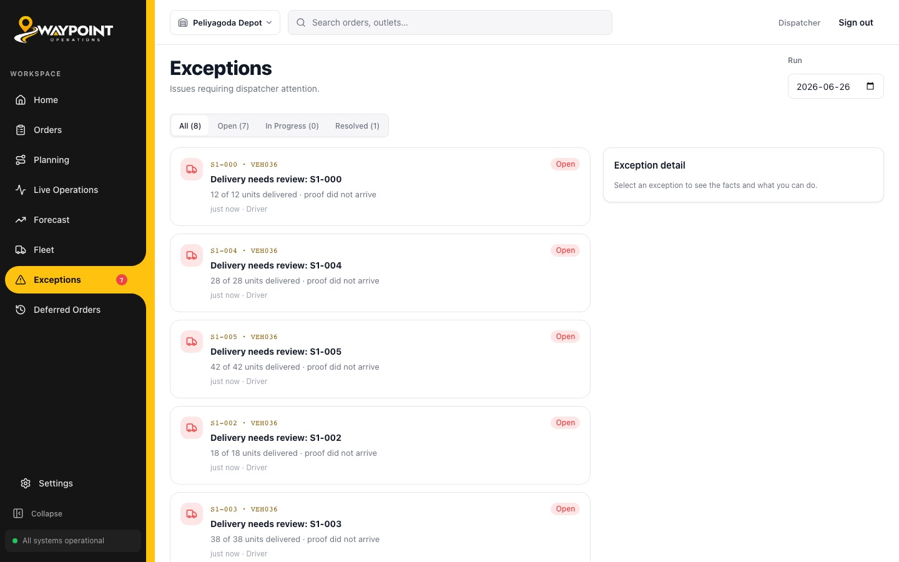
*Centralized dispute triage queue aggregating dock shortfalls, driver delivery failures, and store receipt disputes for binding dispatcher resolution.*

#### Advisory Demand Forecasting
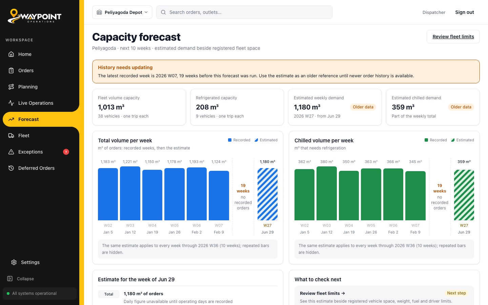
*10-week rolling demand forecast analyzing historical order volume trends by brand and depot. Displays an honest unavailable state when training datasets are unmounted.*

---

## Judge Walkthrough

Follow this deterministic sequence to evaluate the complete four-role lifecycle using seeded demo scenario **`ORD-1163`** (Fresh brand, Chilled, Outlet `OUT001`) on operating date **`2026-06-26`**. You can evaluate live at **[https://techtrithalon.duckdns.org](https://techtrithalon.duckdns.org)** or watch the end-to-end walkthrough video at **[YouTube Walkthrough](https://youtu.be/PAZZ5sISb48)**:

1. **Dispatcher (`DSP-001`) — Plan & Validate**:
   - Log in at `/login` as Dispatcher.
   - Navigate to **Planning** for operating date `2026-06-26`.
   - Allocate `ORD-1163` to vehicle `VEH036` (Peliyagoda refrigerated truck), Trip 1.
   - Observe the validation panel verify rules R1–R12 with zero violations.
   - Click **Publish Plan**. This freezes the schedule, deducts fuel quotas, and generates load tasks.
2. **Warehouse Loader (`LDR-001`) — Count & Handover**:
   - Log in as Loader. Open the published trip for `VEH036`.
   - Verify the line items and manifest case count.
   - Complete manifest check and click **Hand over to Driver**.
3. **Field Driver (`DRV-001`) — Deliver & Capture POD**:
   - Log in as Driver on mobile or phone viewport.
   - Open **Active Trip** and tap **Start Trip**.
   - Select the `OUT001` stop, tap **Arrive**, then tap **Deliver**.
   - Capture recipient signature and submit Proof of Delivery.
   *(Optional offline test: toggle DevTools to Offline before submitting delivery; restore connectivity to verify background outbox sync).*
4. **Store Manager (`STM-001`) — Confirm Receipt**:
   - Log in as Store Manager for Outlet `OUT001`.
   - Navigate to **Deliveries**, open the newly delivered order, and click **Confirm Receipt**.
5. **Dispatcher (`DSP-001`) — Verify Closed Loop**:
   - Return to Dispatcher portal. Check **Live Operations** to observe completed trip telemetry, and **Exceptions** to verify clean resolution.

---

## Technical Architecture

### System Layer Architecture

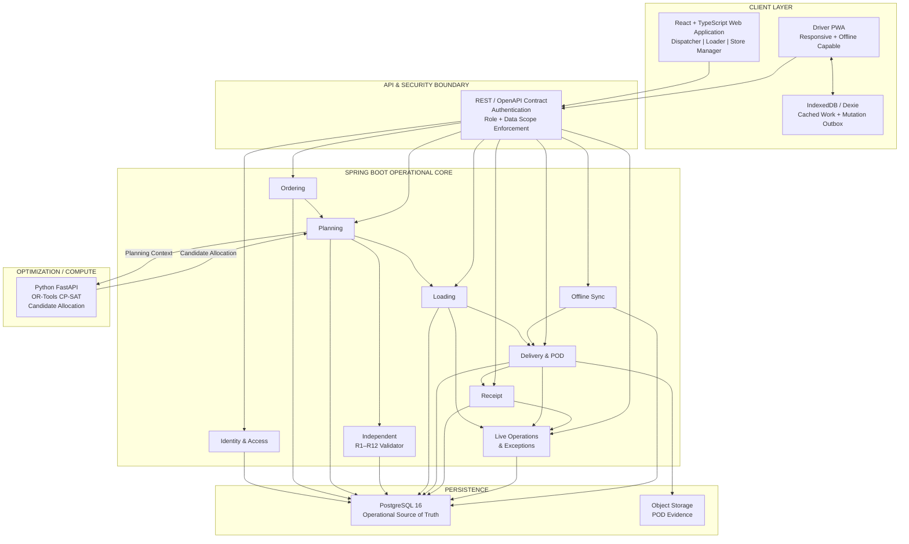

### Core Architectural Principle

Spring Boot is the sole operational authority. Python services execute bounded optimization and return proposed candidate allocations. Python has no database credentials and performs no direct persistence. Every candidate plan must pass Spring Boot's independent constraint validator before publication.

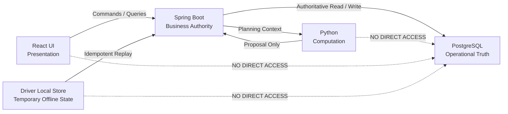

---

## Planning & Constraint Engine

### The 12 Hard Operational Constraints (R1–R12)

All manual and automated trip allocations are evaluated against twelve deterministic rules implemented in `lk.techtrithalon.waypoint.planning.domain.rules`:

| Rule ID | Constraint Name | Technical Code | Rule Specification |
|:---:|---|---|---|
| **R1** | **Brand & District Exclusivity** | `SAME_BRAND_DISTRICT` | A single trip may carry goods for **exactly one brand** and deliver to **one district** only. |
| **R2** | **Temperature Compatibility** | `TEMPERATURE_COMPATIBILITY` | Chilled goods require a refrigerated vehicle (`reefer`). Ambient goods may be carried by reefers or standard vehicles. |
| **R3** | **Vehicle Access Restrictions** | `VEHICLE_ACCESS` | Outlets designated `van_only` can only be serviced by vans due to physical access limits. |
| **R4** | **Depot Affinity** | `DEPOT_AFFINITY` | A vehicle belongs to a home depot (Peliyagoda or Kandy) and only delivers trips originating from that depot. |
| **R5** | **Whole Order Delivery** | `WHOLE_ORDER` | Orders cannot be split across multiple trips or vehicles. |
| **R6** | **Vehicle Capacity Ceilings** | `TRIP_CAPACITY` | Aggregated volume ($m^3$) and weight ($kg$) on a trip must not exceed vehicle ratings. |
| **R7** | **Daily Trip Slot Ceiling** | `TRIP_COUNT` | A vehicle may run at most two trips per operating day (Trip 1 and Trip 2). |
| **R8** | **Delivery Window Adherence** | `DELIVERY_WINDOW` | Deliveries must arrive within the outlet delivery window, accounting for mall opening hours. |
| **R9** | **Weekly Fuel Allocation** | `FUEL_QUOTA` | Total estimated fuel consumption across the week must not exceed the vehicle quota ($L$). |
| **R10** | **Operating Calendar** | `OPERATING_DAY` | Deliveries only occur on valid operating days (Monday through Saturday, non-holidays). |
| **R11** | **Daily Time Budgets** | `TIME_BUDGET` | Fresh trips must finish within 270 minutes (03:30–08:00); Style & Tech trips combined within 480 minutes. |
| **R12** | **Vehicle Availability** | `VEHICLE_AVAILABILITY` | Vehicles marked `in_workshop` cannot be assigned to any trip. |

### Planning Authority Workflow

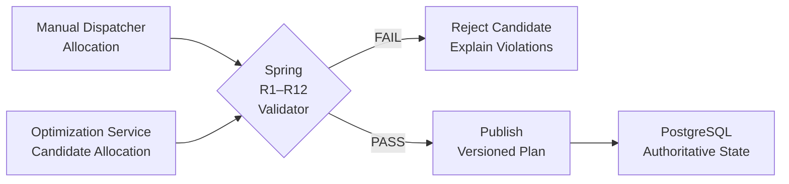

> **Optimization proposes. Validation decides. Persistence records.**

---

## Offline & Recovery

Field drivers frequently operate in areas with intermittent cellular coverage. The field architecture enables uninterrupted local execution:

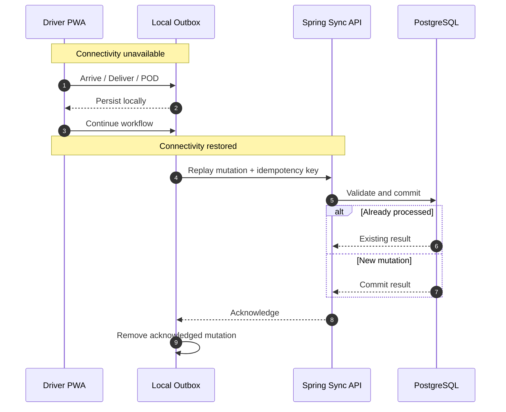

- **Local Persistence**: Driver trip state, stop itineraries, and captured proof (signatures and photos) are stored locally in IndexedDB via Dexie.js.
- **Idempotent Synchronization**: When connectivity resumes, queued mutations replay to `/api/v1/driver/sync`. Each mutation includes a client-generated UUID idempotency key preventing duplicate processing.
- **Conflict Handling**: Unresolvable conflicts are persisted and flagged in the Dispatcher Exceptions queue for review rather than silently dropped.

---

## Resilience by Design

| Failure / Degradation Mode | System Behaviour |
|---|---|
| **Driver loses cellular connectivity** | Client transitions seamlessly to offline mode; operations persist to local outbox; field execution continues without interruption. |
| **Network mutation retried** | Server-side idempotency keys detect duplicate submissions, returning the existing persisted outcome without duplicate writes. |
| **Optimization service unavailable** | Dispatcher manual planning and deterministic heuristics remain 100% operational; core scheduling does not fail. |
| **Candidate plan violates constraints** | Independent validator rejects publication, flags specific rule violations (R1–R12), and prevents database commitment. |
| **Warehouse loading shortfall** | Loader shortfall report immediately places the vehicle slot on HOLD, prevents departure, and routes an incident to Dispatcher Exceptions. |
| **Store delivery discrepancy** | Store Manager dispute is recorded with line-item detail and routed to Dispatcher Exceptions for credit note or redelivery decision. |

---

## Security & Data Integrity

- **Opaque Server-Side Sessions**: Authentication uses high-entropy session tokens stored as SHA-256 hashes in PostgreSQL. No credentials or JWTs are stored in browser localStorage.
- **HttpOnly Cookies**: Session cookies are configured with `HttpOnly; SameSite=Lax; Path=/` (`Secure` enabled on HTTPS deployments) to mitigate token exfiltration.
- **Role & Scope Authorization**: Role checks (`DSP`, `STM`, `LDR`, `DRV`) and entity scope (e.g., store manager restricted to assigned outlet) are enforced at the service boundary.
- **Anti-CSRF Protection**: All mutating requests require the custom header `X-Requested-With: Waypoint`.
- **Brute-Force Rate Limiting**: In-memory rate limiting throttles authentication attempts to 5 failures per 15 minutes per IP/account, returning RFC 7807 problem details with `429 Too Many Requests`.
- **Server-Derived Business Metrics**: Volumetric capacities, payload utilization, fuel allowances, and delivery dates are strictly computed server-side.

---

## Technology Stack

| Layer | Technology | Operational Responsibility |
|---|---|---|
| **Web Client** | React 19 · TypeScript 5.7 · Vite | Role-based operational workspaces and responsive interfaces |
| **Client State** | TanStack Query 5 | Server-state caching, optimistic updates, and background refetching |
| **Offline Storage** | Dexie.js (IndexedDB) | Driver local cache and durable mutation outbox |
| **Backend API** | Java 21 · Spring Boot 3.5 | Domain logic, business rule enforcement, and transactional persistence |
| **API Contract** | OpenAPI 3.1 (`openapi-fetch`) | Drift-checked, type-safe communication between frontend and backend |
| **Database** | PostgreSQL 16 · Flyway | Authoritative operational source of truth and schema migrations |
| **Optimization** | Python 3.12 · FastAPI · OR-Tools | Advisory candidate allocation and demand aggregation |
| **Runtime** | Docker · Docker Compose · Nginx | Reproducible local development and production container stack |
| **Deployment** | AWS EC2 · Let's Encrypt SSL | Hosted competition environment with automatic HTTPS termination |

---

## Demo Accounts

| Role | User ID | Password Configuration | Scope & Initial View |
|---|---|---|---|
| **Dispatcher** | `DSP-001` | Set in `.env` (`SEED_DISPATCHER_PASSWORD`) | Full system visibility (Peliyagoda & Kandy depots) |
| **Store Manager** | `STM-001` | Set in `.env` (`SEED_STORE_MANAGER_PASSWORD`) | Retail outlet `OUT001` (Fresh, Colombo) |
| **Warehouse Loader** | `LDR-001` | Set in `.env` (`SEED_LOADER_PASSWORD`) | Peliyagoda distribution depot |
| **Field Driver** | `DRV-001` | Set in `.env` (`SEED_DRIVER_PASSWORD`) | Vehicle `VEH036` (Refrigerated 4-ton) |

*The login page includes quick-role selector chips that automatically populate credentials for testing.*

---

## Run Locally

### Prerequisites

- **Docker Desktop** (Engine 24.0+ and Compose 2.20+)
- For non-container development: **JDK 21**, **Node.js 20** (with Corepack / pnpm 10), **Python 3.12+**

### 1. Setup Environment & Reference Data

```bash
# Clone repository and create local environment file
cp .env.example .env

# Set secure passwords (12+ characters) in .env for seed accounts:
# SEED_DISPATCHER_PASSWORD, SEED_STORE_MANAGER_PASSWORD,
# SEED_LOADER_PASSWORD, SEED_DRIVER_PASSWORD
```

Ensure competition General Data CSVs are placed locally in `dataset/` (git-ignored):
```
dataset/data/General Data/outlets.csv
dataset/data/General Data/vehicles.csv
dataset/data/General Data/calendar.csv
dataset/data/General Data/district_travel.csv
dataset/data/General Data/service_allowance.csv
```

### 2. Start Application Stack

```bash
docker compose up --build
```

| Service | Access URL | Description |
|---|---|---|
| **Web Application** | `http://localhost:5173` | React 19 Frontend (Desktop & Mobile PWA) |
| **Operational API** | `http://localhost:8080/api/v1` | Spring Boot Operational Core |
| **API Contract Docs** | `http://localhost:8080/v3/api-docs` | OpenAPI 3.1 Specification |
| **Intelligence Service**| `http://localhost:8000/health` | Python Advisory Service |
| **PostgreSQL Database** | `localhost:5432` | PostgreSQL Operational Database |

### 3. Seed Demo Operational Day

```bash
# Seed interactive lifecycle states on the demo operating date (2026-06-26)
python3 scripts/seed-operating-day.py --enrich-existing

# Verify persisted state across all role views
python3 scripts/seed-operating-day.py --verify-only
```

---

## Repository Structure

```
TechTrithalon/
├── apps/
│   ├── api/                              Spring Boot 3.5 operational API
│   │   ├── openapi.json                  Committed OpenAPI contract (drift-checked by tests)
│   │   └── src/main/java/lk/techtrithalon/waypoint/
│   │       ├── shared/                   Cross-cutting: error envelope, Clock, CORS, OpenAPI
│   │       ├── reference/                Outlets, vehicles, calendar, travel matrix seeder
│   │       ├── identity/                 Authentication, session management, RBAC
│   │       ├── ordering/                 Order lifecycle, cutoff rules (16:00), catalog
│   │       ├── fleetops/                 Vehicle availability, maintenance, fuel ledger
│   │       ├── planning/                 Snapshots, constraint engine (R1–R12), validator
│   │       ├── loading/                  Warehouse load tasks, shortfalls, vehicle holds
│   │       ├── delivery/                 Stop execution, proof of delivery (POD)
│   │       ├── receipt/                  Store receipt confirmation, dispute management
│   │       ├── exceptions/               Operational triage queue for shortfalls and disputes
│   │       ├── forecast/                 Weekly demand forecasting aggregations
│   │       └── sync/                     Offline mutation ingestion and deduplication
│   │
│   ├── web/                              React 19 web application & PWA
│   │   ├── public/                       Service worker, web manifest, PWA icons
│   │   └── src/
│   │       ├── app/                      Router, TanStack Query setup, role shells
│   │       ├── features/                 auth · ordering · planning · loading · delivery ·
│   │       │                             receipt · live-ops · fleet · forecast · offline
│   │       ├── components/               Figma-aligned design system components
│   │       └── generated/                Generated OpenAPI TypeScript client types
│   │
│   ├── mobile/                           React Native Expo driver APK codebase
│   └── intelligence/                     Python 3.12 FastAPI optimization service
│
├── packages/
│   ├── api-client/                       Shared generated OpenAPI client
│   ├── field-core/                       Shared offline outbox and sync engine
│   └── design-tokens/                    Design tokens from Figma styles
│
├── infrastructure/                       Dockerfiles, Nginx configurations, compose files
├── screenshots/                          System UI walkthrough screenshots
├── docs/                                 Architecture, technical reference, work log
├── docker-compose.yml                    Container stack orchestration
└── Makefile                              Smoke, build, and verification targets
```

---

## Testing & Verification

```bash
# 1. Spring Boot unit, contract, and Testcontainers integration tests (requires Docker)
cd apps/api && ./gradlew test

# 2. Python intelligence service tests
cd apps/intelligence && pytest

# 3. Web frontend linting, type-checking, and Vitest component suite
corepack pnpm --dir apps/web lint
corepack pnpm --dir apps/web typecheck
corepack pnpm --dir apps/web test

# 4. Multi-role Playwright end-to-end browser journeys
corepack pnpm --dir apps/web test:e2e

# 5. Whole-stack integration smoke test against running containers
make smoke
```

### Verification Layers

| Test Suite | Scope & Proven Guarantees |
|---|---|
| **`ReferenceSeedIT`** | Verifies idempotent reference CSV seeding (120 outlets, 60 vehicles, 910 calendar days). |
| **`ConstraintEngineTest`** | Validates all twelve hard rules (R1–R12) against synthetic edge and violation cases. |
| **`OpenApiContractTest`** | Fails build if committed `openapi.json` drifts from running Spring controllers. |
| **`ApiExceptionHandlerTest`**| Asserts RFC 7807 error format, machine-readable error codes, and trace ID propagation. |
| **`lifecycle.spec.ts`** | Complete browser journey testing order placement, publish, load, deliver, and receipt. |

---

## Data Provenance & Design Decisions

### Data Classification

- **Competition Data**: Natural reference entities (120 outlets, 60 vehicles, 910 calendar days, 12 districts, 9 service allowances) loaded idempotently from General Data CSVs.
- **Derived Data**: District travel matrices, delivery window intersections, and trip formula times derived deterministically from competition rules.
- **Demo & Enrichment Data**: Synthetic product catalog items (item names, categories, and relative sizing) enabling multi-line order placement without fictitious prices; seeded demo date `2026-06-26` orders.
- **User-Entered Operational Data**: Placed orders, loading verification counts, driver signature/photo POD records, store receipt confirmations, and dispatcher exception decisions.

### Notable Design Departures

In accordance with strict data integrity rules, the system makes deliberate departures from early design wireframes:

| Early Design Wireframe | Operational Implementation | Technical Rationale |
|---|---|---|
| Monetary prices and "monthly spend" cards | Synthetic catalog uses relative item sizing; no prices | The 92,307 historical dataset orders contain weights and volumes, but zero pricing data. Fabricating monetary values would violate data integrity rules. |
| "± 10 min" ETA uncertainty band | Planned delivery window and calculated arrival shown as distinct facts | No historical variance model is provided in competition data; inventing an arbitrary uncertainty band would be misleading. |
| 10-week forecast always populated | Honest "Unavailable" state when training data is unmounted | Forecast projections require historical training CSVs. When unmounted, the interface displays an honest empty state. |

---

## AI Tool Disclosure

A detailed log of AI assistance utilized across design, architectural documentation, and code verification is audited in [`docs/AI_DISCLOSURE.md`](docs/AI_DISCLOSURE.md). All AI-assisted artifacts were reviewed, validated with automated test suites, and verified against running container environments before acceptance.

---

## Documentation

- [Implementation Plan](docs/IMPLEMENTATION_PLAN.md) — Detailed phase-by-phase build checklist and milestone gates
- [Technical Reference](docs/TECHNICAL_REFERENCE.md) — In-depth architectural specification, data model, and mathematical formulations
- [Architecture & Data Model](docs/architecture/) — Component diagrams, deployment topologies, and database schemas
- [Work Log & Audit Trail](docs/WORK_LOG.md) — Chronological history of engineering decisions, ad-hoc tasks, and UI refinements
- [Round 2 Requirements Audit](docs/ROUND2_REQUIREMENTS_AUDIT.md) — Competition scoring rubric alignment and gap analysis
