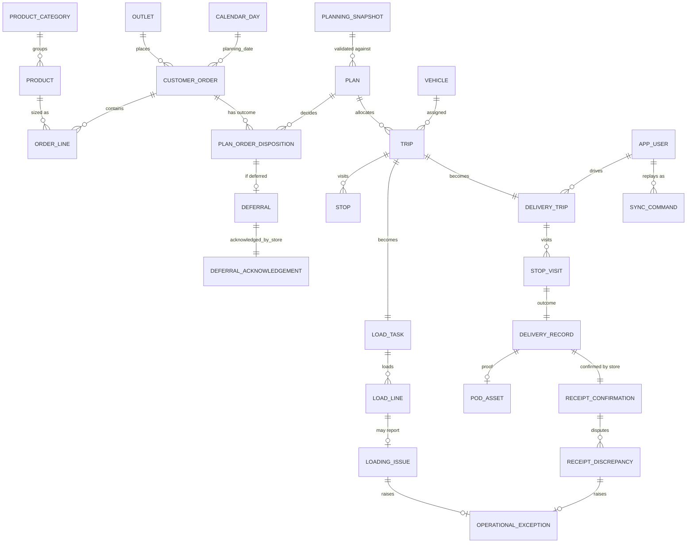

# Data model

Postgres schema, built by 17 Flyway migrations in
[`apps/api/src/main/resources/db/migration/`](../../apps/api/src/main/resources/db/migration/).
Grouped by the module that owns each table (see [`diagram.md`](diagram.md) for module
boundaries). `app_user`, `calendar_day`, `outlet` and `vehicle` are the tables most other tables
reference.

## Reference and identity

| Table | Holds | Source |
|---|---|---|
| `outlet` | 120 retail outlets: brand, district, access type (`van_only` etc.), window | General Data (competition) |
| `vehicle` | 60 vehicles: capacity, refrigeration, home depot | General Data |
| `vehicle_availability` | Per-day workshop/availability status | General Data + operational updates |
| `calendar_day` | 910 days: `is_operating`, holidays | General Data |
| `district_travel` | Inter-district travel times | General Data |
| `service_allowance` | Service-time allowances by outlet type | General Data |
| `fuel_ledger` | Per-vehicle weekly fuel quota consumption | Derived from trips |
| `app_user` | Accounts for all four roles; a driver row links to `vehicle_id`, a store manager to an outlet | Seeded + user-entered |
| `user_session` | Login sessions | User-entered |
| `audit_event` | Append-only audit log of state-changing actions | Generated by every module |

## Ordering (`ordering`)

| Table | Holds |
|---|---|
| `customer_order` | One row per store order, keyed to `outlet_id` and `planning_date` (`calendar_day`); temperature (ambient/chilled) is part of the natural key so a Fresh outlet can place both on the same day |
| `order_line` | Line items against `product`, only when the synthetic catalog is used |
| `product_category`, `product` | Synthetic, demo/enrichment catalog (30 items, 12 categories) — no prices, sized server-side from historical per-unit averages |

## Planning (`planning`)

| Table | Holds |
|---|---|
| `planning_snapshot` | A frozen, content-hashed view of orders + fleet + windows + fuel state at close-of-day, so a plan is validated against a fixed input |
| `plan` | One planning run against a snapshot; `based_on_plan_id` / `superseded_by_plan_id` chain revisions |
| `plan_order_disposition` | Per-order outcome within a plan (allocated / deferred) |
| `deferral`, `deferral_acknowledgement` | A deferred order with its required reason code, and the store's acknowledgement |
| `trip`, `stop` | A vehicle's trip within a plan, and its ordered stops; `(trip_id, plan_id)` is the stable identity carried into loading and delivery |

## Loading (`loading`)

| Table | Holds |
|---|---|
| `load_task` | One loader's work item for a trip; `replaces_task_id` tracks reissue after a shortfall |
| `load_line` | Per-order-line loaded quantity against the manifest |
| `loading_issue` | Shortfall or damage reported during loading, with `carried_from_line_id` linking a short line to its original |

## Delivery (`delivery`) and sync (`sync`)

| Table | Holds |
|---|---|
| `delivery_trip` | The driver-facing trip record, `driver_user_id` set when started |
| `stop_visit` | Arrival/departure at a stop |
| `delivery_record` | Outcome for a stop (delivered / failed), recorded by `recorded_by` |
| `pod_asset` | Proof-of-delivery photo reference (Cloudinary URL — ADR 0001), one-to-one with `delivery_record_id` |
| `sync_command` | Idempotent offline command log; replay key lets a retried command no-op instead of double-applying |

## Receipt and exceptions (`receipt`, `exceptions`)

| Table | Holds |
|---|---|
| `receipt_confirmation` | Store's confirmation against a `delivery_record`, one-to-one |
| `receipt_discrepancy` | A disputed line, `resolved_by` set once the dispatcher closes it |
| `operational_exception` | The unified queue the dispatcher works: loading, delivery, offline and receipt problems in one place, `claimed_by` / `decided_by` tracking ownership |

## Forecast (`forecast`)

| Table | Holds |
|---|---|
| `demand_history_week` | Weekly aggregated demand per depot/brand, derived from `Training Data/deliveries_train.csv` when present; the forecast endpoint returns an honest "unavailable" state when it is not |

## Key relationships

`TRIP` is the join point between planning and the field: the same `(trip_id, plan_id)` identity
is what `load_task` and `delivery_trip` both key off, so a dispatcher, loader and driver are
always looking at the same trip.
