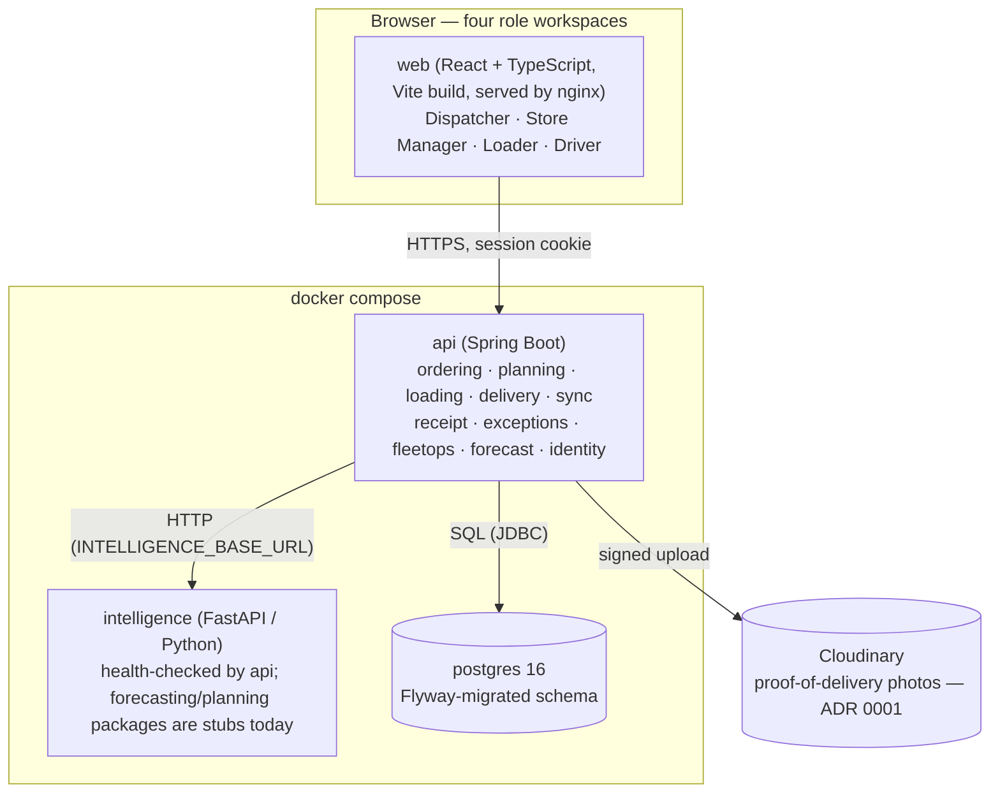
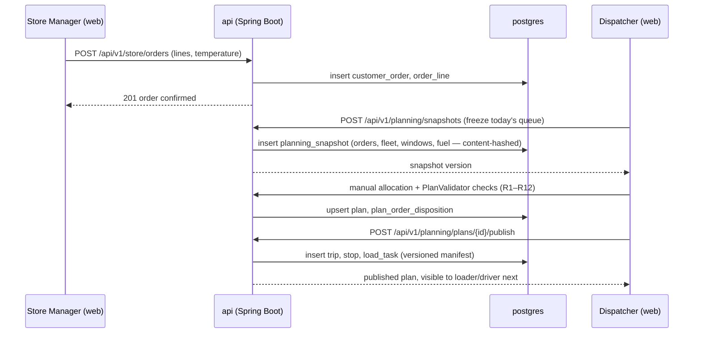
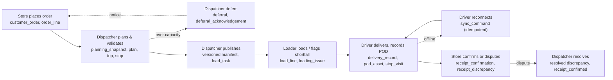

# Architecture diagram

## Components and deployment

Four containers, defined in [`docker-compose.yml`](../../docker-compose.yml): a Postgres database,
a Spring Boot API, a Python intelligence service, and a static web build served behind nginx. The
API is the only service that talks to the database or to intelligence; the web app only ever calls
the API.

Each role's web client talks to the same API through a single generated OpenAPI client
(`apps/web/src/generated/api.d.ts`, regenerated from `apps/api/openapi.json`), so the frontend
cannot silently drift from the backend contract.

## Request flow — placing and planning an order

## Cross-role order lifecycle

One order reference travels through every role; this is what
[`tests/e2e/lifecycle.spec.ts`](../../tests/e2e/lifecycle.spec.ts) exercises end to end.

## Module boundaries (Spring Boot, `apps/api`)

Each business concern is its own Java package under
`apps/api/src/main/java/lk/techtrithalon/waypoint/`, matching one or more Flyway migrations and
its own integration test suite:

| Module | Owns |
|---|---|
| `identity` | Accounts, sessions, login |
| `reference` | Outlets, vehicles, calendar, district travel, service allowances (General Data import) |
| `ordering` | Customer orders, order lines, synthetic product catalog |
| `planning` | Snapshots, the twelve constraint rules, plans, deferral, publication |
| `loading` | Load tasks/lines, shortfall/damage issues |
| `delivery` | Trips, stops, delivery records, proof of delivery |
| `sync` | Idempotent offline command replay and conflict storage |
| `receipt` | Store delivery view, receipt confirmation/dispute |
| `exceptions` | Cross-role exception queue (loading, delivery, offline, receipt) |
| `fleetops` | Fleet status and availability |
| `forecast` | Weekly demand history and the advisory outlook |
| `audit` | Audit event log |
| `notification`, `intelligence` (under `apps/api`) | Declared package structure, not yet populated — see §11 of `ROUND2_FINAL_COMPLETION_PLAN.md` |
| `shared` | Cross-cutting error handling, web config, request-id filter |
| `system` | `/health` and system status |

`planning`'s `PlanValidator` is the single source of truth for the twelve rules (R1–R12); nothing
else re-implements them, so a manual decision and an eventual automatic planner are checked by the
same code.
